# Main results

## How does $group$ interact with $fairness$, $total\, stake$, and $reappraisal\, direction$?

$$AcceptOffer = ReappraisalDirection * scale(fairLR) * scale(totalStake) + \\ReappraisalDirection * group4 + scale(fairLR) * group4 + scale(totalStake) * \\group4 + (1 | ID/block)$$

**The reference is $baseline$, $attempter$, and $attempterHL$.**

 ```*p<0.1; **p<0.05; ***p<0.01```

1. Main effect:

   - ReappraisalDirectionempathy                                           0.723**          
   - ReappraisalDirectionpunish                                              -2.088***         
   - scale(fairLR)                                                                          2.248***          
   - Empathy is more likely to accept the offer compared to the baseline.
   - Punishment is less likely to accept the baseline.
   - stake size has no effect.
   - The fairer, more acceptance.
   - Groups are not significantly differ from the $attempter$.

2. $fairness * group$

   - scale(fairLR):group4depression                                       -0.354*** 

   - scale(fairLR):group5AttempterLL                                      0.351***          

   - scale(fairLR):group5control                                              0.322***          

   - scale(fairLR):group5depression                                        -0.182*          

   - scale(fairLR):group5ideator                                               0.311**          

   - As the offers getting fairer, the depression is less likely to accept offers than attempters.

   - As the offers getting fairer, the attempterLL, control, and ideation are more likely to accept offers than the attempterHL. But the depression is less likely to accept offers than the attempterHL.

     

     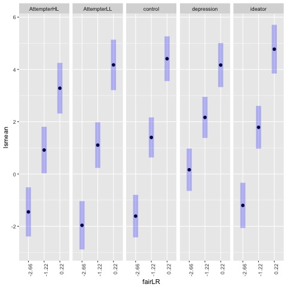

3. $total\,stake * group$

   - scale(totalStake):group4control                                      -0.200** 

   - scale(totalStake):group4depression                                -0.138* 

   - scale(totalStake):group5control                                      -0.213**          

   - As the magnitude of stake increases, the control and depression are less likely to accept offers than attempters. The attempter are more likely to accept offers as the magnitude increases.

   - As the magnitude of stake increases, the control is less likely to accept offers than attemptersHL. The attempter is more likely to accept offers as the magnitude increases.

     ​

     

     

4. $ReappraisalDirection * group$

   - ReappraisalDirectionempathy:group4control                             1.037** 

   - ReappraisalDirectionempathy:group4ideator                             1.249**

   - ReappraisalDirectionempathy:group4depression                       3.339*** 

   - ReappraisalDirectionpunish:group4depression                          2.311***

   - ReappraisalDirectionempathy:group5AttempterLL                     -1.090* 

   - ReappraisalDirectionempathy:group5depression                        2.795***

   - ReappraisalDirectionpunish:group5depression                           2.001***          

   - The control and ideator accepts more under empathy than the attempter.

   - The depression is more likely to accept offers under both empathy and punishment context than the attempter and the attempterHL. The depression seems being more likely to accept offers under punishment and empathy than the baseline, but the other groups are more likely to accept offers under empathy and less likely to do so under punishment. 

   - The attempterLL is less likely to accept offers under empathy than the attempterHL. Hence, the significant differences between control and the attempter, the ideator and attempter (in group4) may largely driven by the lower tendency of offer acceptance of the attempterLL.

     ​

     

     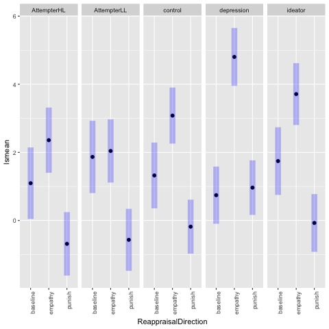

5. $ReappraisalDirection * total\,stake*fairness$

   - ReappraisalDirectionempathy:scale(fairLR):scale(totalStake)           0.222** 
   - ReappraisalDirectionempathy:scale(fairLR):scale(totalStake)           0.221**          

6. $ReappraisalDirection * fairness$

   - ReappraisalDirectionempathy:scale(fairLR)                                     -1.348*** 
   - ReappraisalDirectionpunish:scale(fairLR)                                        -1.330***    

7. $ReappraisalDirection * total\,stake$

   - ReappraisalDirectionpunish:scale(totalStake)                                   0.275***  

8. $fairness * total\,stake$

   - scale(fairLR):scale(totalStake)                                                           -0.125*       


## Whether the interaction of $fairness*total\,stake*group5$ exists? A replication of the previous study. 

$$AcceptOffer = ReappraisalDirection * scale(fairLR) * scale(totalStake) + ReappraisalDirection * group5 + \\scale(fairLR) * group5 + scale(totalStake) * group5 + scale(fairLR) * scale(totalStake) * group5 + \\(1 | ID/block)$$

1. Main effect

   - Empathy is more likely to accept the offer compared to the baseline.
   - Punishment is less likely to accept the baseline.
   - Stake size has no effect.
   - The fairer, more acceptance.
   - Groups are not significantly differ from the $attempter$.

2. $ReappraisalDirection * group$

   - ReappraisalDirectionempathy:group5AttempterLL                         -1.002*          

   - ReappraisalDirectionempathy:group5depression                            2.881***   

   - ReappraisalDirectionpunish:group5depression                               1.952***                                      

     ​                             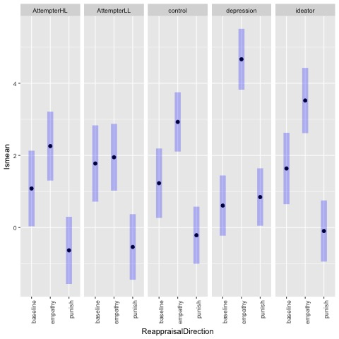                  

3. $fairness * group$

   - scale(fairLR):group5AttempterLL                                                     0.345***          

   - scale(fairLR):group5control                                                              0.333***          

   - scale(fairLR):group5ideator                                                               0.312**   

   - As offers gets farier, the tendency of offer acceptance is higher in the attempterLL, the control, and the ideator than the attempterHL. Only the depression has the similar tendency with the attempterHL

     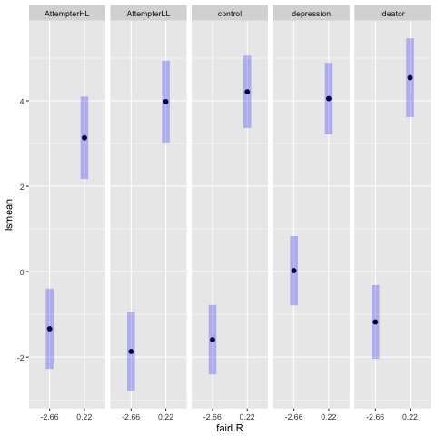

4. $total\, stake * group$

   - scale(totalStake):group5depression                                                 -0.184*       

   - scale(totalStake):group5control                                                       -0.233**  

   - As the stake size increases, the attempterHL is more likely to accept offers compared to the control and the depression.

     ​                          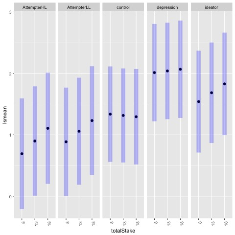  

     ​

     ​                 

     ​

5. $fairness * total\, stake * group$

   - scale(fairLR):scale(totalStake):group5depression                            -0.319***   
   - The depression is less likely to accept fairer offers as the stake size increases than the attempterHL.

   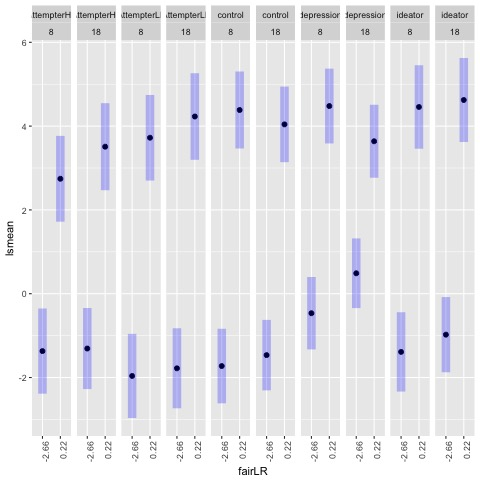

   6. $fairness*total\, stake$
      - scale(fairLR):scale(totalStake)                                            0.039           

#### Comparison with the previous study

- The previous study shows $group * magnitude$ interaction. The control, depression, attempterLL accepted fewer high stake size offers. The current study found the similar interaction effect in the control and depression, they are less likely to accept offers with the increasing stake size, compared to the attempterHL
- The previous study did not find $fairness*magnitude$ and $fairness*magnitude*group$ interaction. The current study does not find $fairness*magnitude$, but $fairness*magnitude*group$. The depression is less likely to accept the fairer offers with the increasing stake size, compared to the attempterHL.

## Individual characteristics on the offer acceptance.

### MMSE $(MMSE *Reappraisal\,Direction)$

$$AcceptOffer = ReappraisalDirection * scale(fairLR) * scale(totalStake) + ReappraisalDirection * group4 + \\ scale(fairLR) * group4 + scale(totalStake) * group4 + ReappraisalDirection*scale(MMSE) + (1 | ID/block)$$

1. Main effect
   - MMSE                                                                                          0.578***  
   - ReappraisalDirectionpunish                                                        -2.350*** 
   - group4depression                                                                        -1.142*                          
2. $Reppraisal\,direction*MMSE$
   - ReappraisalDirectionempathy:scale(MMSE)                                -0.530***         
   - ReappraisalDirectionpunish:scale(MMSE)                                   -0.452***     

*MMSE does not have interaction effect with group.    

### IRI_EMPATHETIC_CONCERN $(IRI\,EMPATHETIC\,CONCERN*Reappraisal\,Direction*group)$

$$AcceptOffer ~ ReappraisalDirection * scale(fairLR) * scale(totalStake) + ReappraisalDirection * group4 + \\scale(fairLR) * group4 + scale(totalStake) * group4 + ReappraisalDirection*scale(IRI+ (1 | ID/block)$$

1. Main effect
   - IRI_EMPATHETIC_CONCERN no effect
2. $group*Empathetic$
   - group4depression:scale(IRI_EMPATHETIC_CONCERN)                     1.593**          

### IIP15INTSEN $(IIP15INTSEN*Reappraisal\,Direction*group)$

1. Main effect
   - IIP15INTSEN no effect
2. $group*IIP15INTSEN$
   - ReappraisalDirectionempathy:scale(IIP15INTSEN)                              0.616* 
   - ReappraisalDirectionpunish:scale(IIP15INTSEN)                                  0.658*             
3. $(IIP15INTSEN*Reappraisal\,Direction*group)$
   - ReappraisalDirectionempathy:group4depression:scale(IIP15INTSEN)          3.062***  

### IIP15AGRESS$(IIP15AGRESS *Reappraisal\,Direction*group4)$

1. It has no main effect
2. $IIP15AGRESS*Reappraisal\,Direction$
   - ReappraisalDirectionempathy:scale(IIP15AGRESS)                                       0.564*   
3. $IIP15AGRESS *Reappraisal\,Direction*group4$
   - ReappraisalDirectionempathy:group4depression:scale(IIP15AGRESS)          2.259***    

   - ReappraisalDirectionpunish:group4depression:scale(IIP15AGRESS)            0.810**   

     ​

### Gender ($Reappraisal\,Direction*gender$)

1. No main effect

2. $gender * Reappraisal\,Direction$

   - ReappraisalDirectionempathy:GENDERTEXTMALE                           1.626***          
   - ReappraisalDirectionpunish:GENDERTEXTMALE                             1.395***          

   

​                     

# Punishment Type

## How does the specific punishment type $resources$ and $reputation$ influence offer acceptance across groups?

**The data set used only include punishment context. The reference is $attempter$ or $attempterHL$, and $reputation$**

$$AcceptOffer ~ PunishingType * scale(fairLR) * scale(totalStake) + PunishingType * group4 + \\scale(fairLR) *group4 + scale(totalStake) * group4 +  (1 | ID/block)$$

1. Main effect:

   - Type resources is less likely to accept the offers than reputation.

   - Type empathy is less likely to accept the offers than reputation.

   - The fairer offers is more likely increase offer acceptance.

   - The higher stake size, the more likely to accept offers

   - group4control                                                                        1.053*

   - group4depression                                                                  2.067***

   - group4ideator                                                                         1.723***

   - All groups are more likely to accept offers than the attempter.

     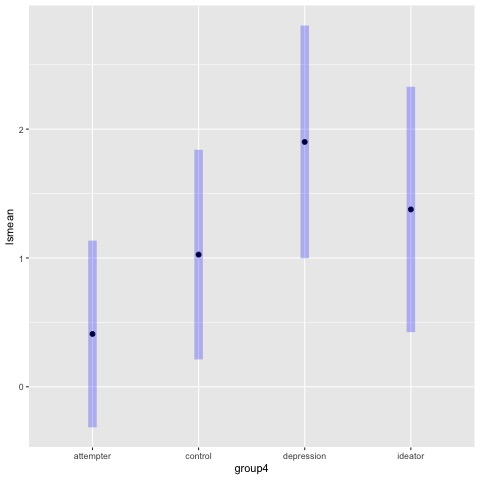

2. $punishType * group$

   - PunishingTyperesources:group4control                               -1.035***

   - PunishingTyperesources:group4depression                         -1.959***

   - PunishingTyperesources:group4ideator                               -1.836***  

   - PunishingTyperesources:group5control                                -0.830**          

   - PunishingTyperesources:group5depression                         -1.754***         

   - PunishingTypeempathy:group5depression                            0.589*  

   - PunishingTypeempathy:group5AttempterLL                           0.701**                   

   - PunishingTyperesources:group5ideator                                -1.632***         

   - The control, the depression, and the ideator are less likely to accept offers under resources context than the attempter.

   - The attempterLL and the control are more likely to accept offers under empathy than the attempterHL.

     ​                                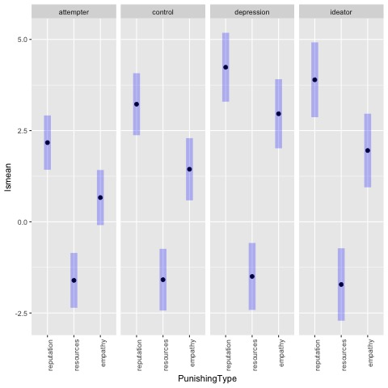     

     ​	                        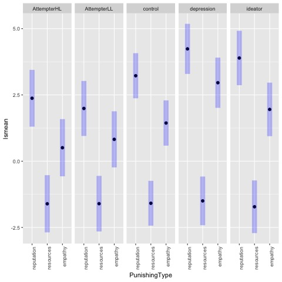                   

3. $fairness * group$

   - scale(fairLR):group4depression                                                 -0.296***   

   - scale(fairLR):group5control                                                         0.264**          

   - scale(fairLR):group5ideator                                                         0.263*           

   - As the fairness increases, the depression has reducing/lower tendency to accept offers compared to the attempter.

   - As the fairness increases, the ideator and the control have increasing tendency to accept offers compared to the attempter.

     ​                                   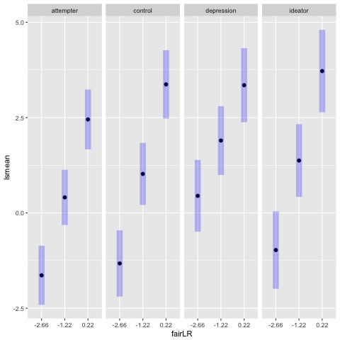

     ​                                   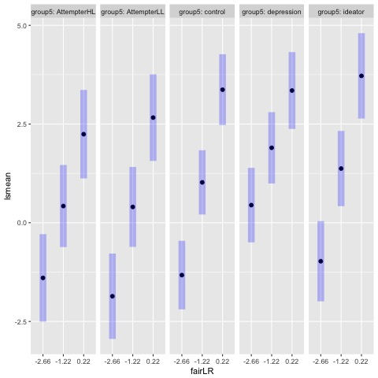      

4. $total\, stake * group$

   - scale(totalStake):group4control                                              -0.289***

   - scale(totalStake):group5control                                              -0.213*          

   - As the stake size increases, the control has lower tendency to accept offers than the attempter and the attempterHL.

     ​                                   

     ​                                   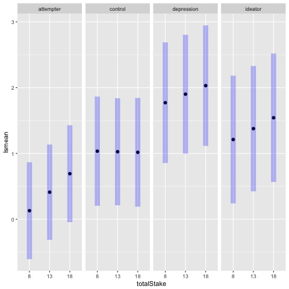   

   ​

5. $punishType * fairness$

   - PunishingTypeempathy:scale(fairLR)                                       0.538***          

6. $punishType * total\,stake$

   - PunishingTypeempathy:scale(totalStake)                                  0.299***        


## Individual Characterstics

### Education($ punishType*education$)

PunishingTyperesources:EDUCATION                                       0.291**          

### Gender ($ punishType*gender$)

PunishingTyperesources:GENDERTEXTMALE                           0.886***          

### MMSE($ punishType*MMSE$)

PunishingTyperesources:MMSE                                                  0.237**          


# Emotional reactivity

## How emotionally reactive a group is under $punish$ and $empathy$ context?

$$Rating = Reappraisa\,lDirection*group4 + (1|ID)$$

1. Main effect:

   - No group and reappraisal direction main effect

2. $Reappraisa\,lDirection*group4$

   - ReappraisalDirectionpunish:group4control                                -0.284***   

   - ReappraisalDirectionpunish:group5control                                 -0.323**

   - The control is less reactive under punish type than the attempter and attempterHL.

     ​                             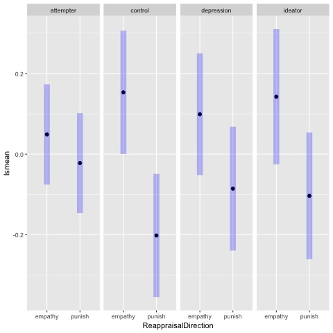

​                                            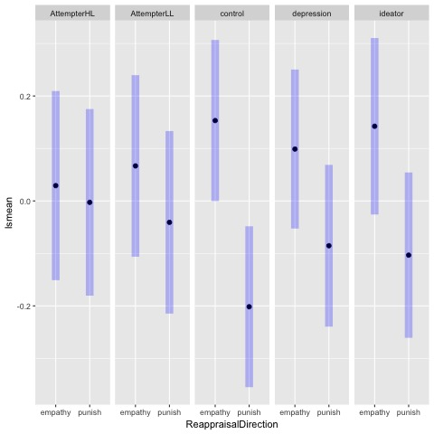


